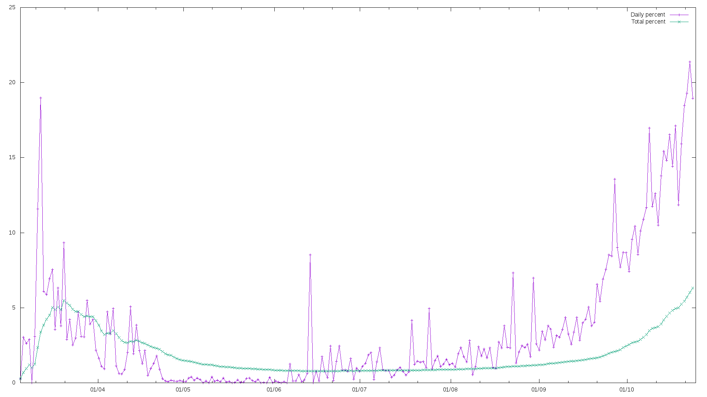

# Korona - percento

(For English scroll down)

## Slovenčina

### O projekte

Koľko percent testovaných ľudí je nakazených?
Každému, kto je pri zmysloch je iste jasné, že zaoberať sa absolútnym počtom pribudnutých prípadov je nezmysel, lebo ten závisí od počtu testovaných.
Meranie percentuálneho podielu nakazených vo vzorke testovaných je oveľa lepšie.

Tento skript vypočíta percentuálny podiel a vytvorí graf z verejne dostupných dát z https://korona.gov.sk

Aj keď treba si uvedomiť, že ani toto nie je dokonalé.
Napríklad aj kvôi tomu, že je väčší záujem testovať podozrivých ako náhodnú vzorku.

### Použitie

Na spustenie potrebujete bežnú linuxovú distribúciu (napr Debian, Ubuntu...), nainštalovaný `gnuplot` a `imagemagick`.
Pre zobrazenie stačí spustiť súbor `./calculate.sh`.
Pre uloženie treba ako parameter skriptu pridať názov výstupného png súboru.

## English

### About

Korona - percentage

How many percent of tested people are infected?
Everyone sane understands that working with the absolute number of infected is a nonsense as it depends on the number of tests.
Measuring percentage of infected among tested is much better.

This script calculates the percentage and creates a chart from publicly available data found at https://korona.gov.sk

Although, you should understand it's still not perfect.
As an example, testing suspicious people is more interesting than testing a random sample.

### Usage

You need an ordinery linux distribution (e.g. Debian, Ubuntu...), `gnuplot` and `imagemagick` installed in order to run this.
Run `./calculate.sh` in order to display the chart.
You need to supply output file path as an argument in order to save the chart as a PNG image.
